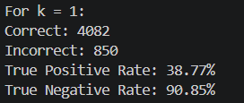
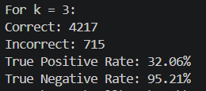

K-neighbors-classifier compiled and trained on the shopping.csv dataset provided by CS50 to predict whether or not the user will make a purchase.

Used skcikit-learn to build the model, experimented with various values of K

Built by Dontad for CS50
